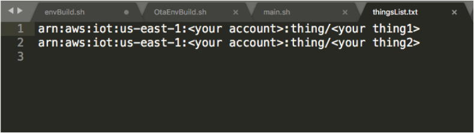
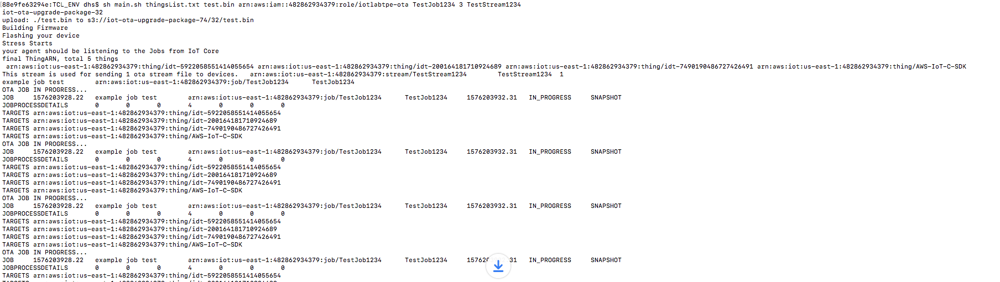
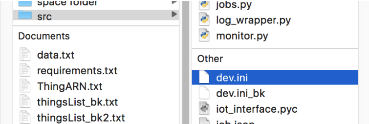
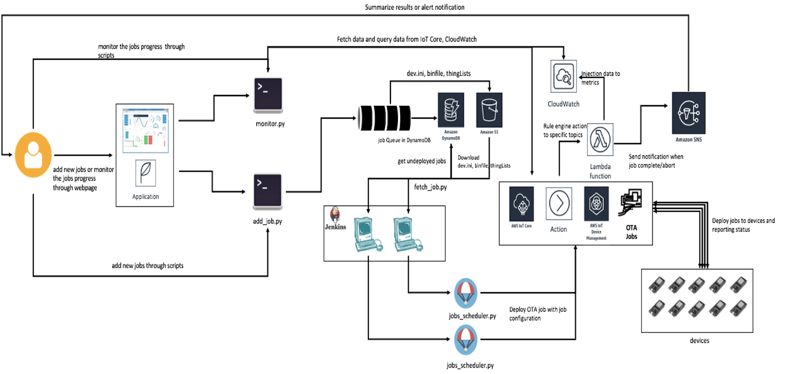
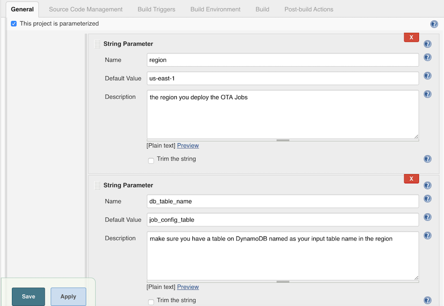
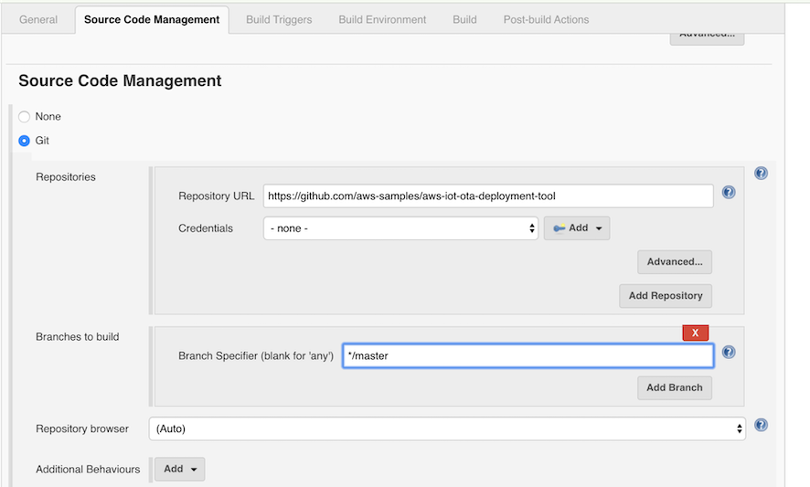
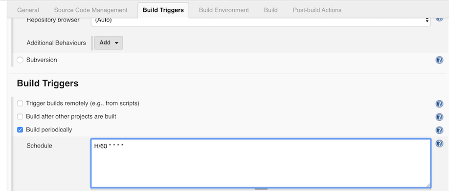
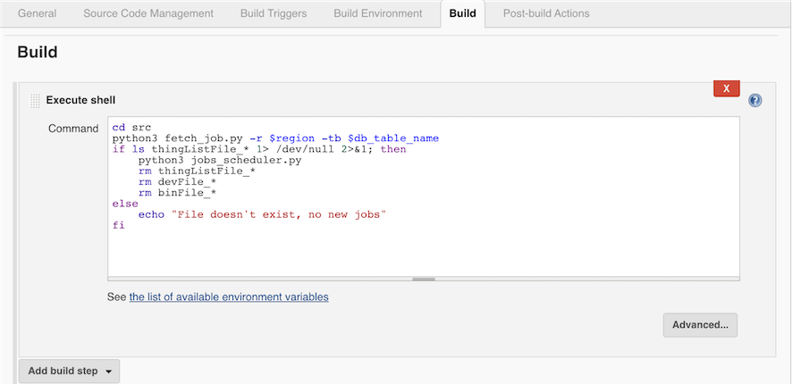

# AWS IoT OTA deployment tool user manual

This document describes tools that can be used for deploying over-the-air (OTA) firmware updates on AWS IoT. The tools can be used for testing OTA firmware updates as well.

# Contents

* **Deploy OTA firmware updates using shell scripts**
* **Deploy OTA firmware updates using python**
* **Integration python ota tools with CICD tools**

# Deploy OTA firmware updates using shell scripts:

## Description:

In the first section we will go through how to setup stress test by using the shell scripts.

## Prerequisites:

1. you need to have AWS account
2. Install[AWS CLI](https://docs.aws.amazon.com/cli/latest/userguide/cli-chap-install.html)and [configure](https://docs.aws.amazon.com/cli/latest/userguide/cli-chap-configure.html)
3. Create IAM user maker sure it has [OTA required user policy](https://docs.aws.amazon.com/freertos/latest/userguide/create-ota-user-policy.html)
4. [Create an OTA update service role](https://docs.aws.amazon.com/freertos/latest/userguide/create-service-role.html)

## Usage:

### List down the devices that will be update through OTA

There are many ways to filter out the target devices of interest.

1. you can create a group of your devices by [AWS IoT Device Management](https://docs.aws.amazon.com/iot/latest/developerguide/thing-groups.html) and use [AWS CLI to describe the ARN of the group](https://docs.aws.amazon.com/cli/latest/reference/iot/describe-thing-group.html), then copy the ARN to thingList.txt
2. you can also [list down the devices one by one with AWS CLI](https://docs.aws.amazon.com/cli/latest/reference/iot/describe-thing.html) and copy the ARN to thingList.txt


After listed down the devices, your thingList.txt file should look like this :


## Running main.sh

sh main.sh <ThingListFile> <BinFile> <RoleARN > <JobID> <Rounds> <StreamID>

**Description:**

main.sh creates the job,stream documents, upload the bin file to S3, parse the thingLists.txt and then starts a deployment or repeated stress test with the parameters

* ThingListFile:
    *  for example Thinglist.txt like the above example(do not include spaces in the path)
* BinFile:
    * the binary that you wish to update, it will be uploaded to S3 by the script durring the test(do not include spaces in the path)
* RoleARN:
    * the ota role you’ve created, it should look like “**arn:aws:iam::123456789:role/your_ota_role**“ and given [OTA update service role](https://docs.aws.amazon.com/freertos/latest/userguide/create-service-role.html) access
* JobID:
    * input the job id you would like to use in the test, and you can track the status on IoT Console, the job will be deleted after the test is completed.
* Rounds:
    * when you use this tool for deploying an OTA firmware update, set this value to 1. Use a value larger than 1 for repeated testing purpose. This tool will deploy the same OTA job repeatedly for $Rounds times; if failure happens, the deployment will stop and the rest of the $Rounds will be skipped.
* StreamID:
    * input the stream id you would like to use in the test. The stream will be deleted after the test is completed.
* PrivateKey (optional):
    * the private key in base64 format, it is optional. We will keep md5 in JSON file as default, if user didn't provide this item, otherwise use signature instead of md5.

### Example:

```
sh main.sh thingsList.txt test.bin arn:aws:iam::<$your_aacount>:role/your_role TestJob1234 3 TestStream1234
```



## Customizing your test

If you use the main.sh script above, it creates json files to describe the job and the stream for you automatically. Your device must be able to handle those specific format. If you need flexibility in defining your own format to match implementation on the device, you can follow the instructions in this section, then run OtaStressStart.sh.

### Template Example:

job document

```
{
    "command": "fota",
    "streamId": "TestStream55667788",
    "fileId": 69,
    "fileSize": 382432,
    "imageVer": "1",
    "md5sum": "afcba86284d600cd21f54dca7c6d8bb6"
}

```

```
    "streamId": "fota-image-v1-stream",
    "fileId": any_integer_between_0_to_255,
    "fileSize": your_fota_image_size_in_Bytes
```


**command:**

A command name that the device will handle and will react to start the download agent

**streamId:**

The stream ID.
Length Constraints: Minimum length of 1. Maximum length of 128.

[**fileId:**](https://docs.aws.amazon.com/iot/latest/apireference/API_CreateStream.html#API_CreateStream_RequestSyntax)

The fileId to stream, it should consistent to the fileId in the stream document

**fileSize:**

The file size of the ota bin file

**imageVer:**

the image version of the ota bin file

**md5sum:**

the md5sum hash value of the ota bin file


```
{
    "streamId": "TestStream55667788",
    "description": "This stream is used for sending 1 ota stream file to devices.",
    "files": [
        {
            "fileId": 69,
            "s3Location": {
                "bucket": "iot-ota-upgrade-package-bb",
                "key": "69/aws_demo.bin"
            }
        }
    ],
    "roleArn": "arn:aws:iam::482862934379:role/iotlabtpe-ota"
}

```

[**streamId**](https://docs.aws.amazon.com/iot/latest/apireference/API_CreateStream.html#API_CreateStream_RequestSyntax)

The stream ID.
Length Constraints: Minimum length of 1. Maximum length of 128.

[**description**](https://docs.aws.amazon.com/iot/latest/apireference/API_CreateStream.html#API_CreateStream_RequestSyntax)

A description of the stream.
Type: String
Length Constraints: Maximum length of 2028.

[**files**](https://docs.aws.amazon.com/iot/latest/apireference/API_CreateStream.html#API_CreateStream_RequestSyntax)

The files to stream.
Type: Array of [StreamFile](https://docs.aws.amazon.com/iot/latest/apireference/API_StreamFile.html) objects
Array Members: Minimum number of 1 item. Maximum number of 50 items.
Required: Yes

[**roleArn**](https://docs.aws.amazon.com/iot/latest/apireference/API_CreateStream.html#API_CreateStream_RequestSyntax)

An IAM role that allows the IoT service principal assumes to access your S3 files.
Type: String
Length Constraints: Minimum length of 20. Maximum length of 2048.
Required: Yes
stream document


### Running OtaStressStart.sh:

sh OtaStressStart.sh <ThingListFile> <JobID> <Rounds> <job.json> <create-stream.json> <StreamID>

**Description**:

OtaStressStart.sh parse the thingLists.txt and then starts the a deployment or repeated stress test. If you want to use your own job/stream documents, you can run OtaStressStart.sh without OtaEnvBuild.sh, and deploy jobs with your customized job/stream documents

* ThingListFile:
    *  for example Thinglist.txt like the above example(do not include spaces in the path)
* JobID:
    * input the job id you would like to use in the test, and you can track the status on IoT Console, the job will be deleted after the test is completed.
    * The scripts will automatically create the job document and create the job, but you cab also follow [this documentation](https://docs.aws.amazon.com/cli/latest/reference/iot/create-job.html) to customize the job document information.
* Rounds:
    * when you use this tool for deploying an OTA firmware update, set this value to 1. Use a value larger than 1 for repeated testing purpose. This tool will deploy the same OTA job repeatedly for $Rounds times; if failure happens, the deployment will stop and the rest of the $Rounds will be skipped.
* StreamID:
    * input the stream id you would like to use in the test. The stream will be deleted after the test is completed.
    * The scripts will automatically create the stream document and create the stream, but you cab also follow [this documentation](https://docs.aws.amazon.com/cli/latest/reference/iot/create-stream.html) to customize the stream document information.
* job.json
    * The job document you’ve customized in the above section. if you run main.sh, the document is created automatically
* create-stream.json
    * The stream document you’ve customized in the above section. if you run main.sh, the document is created automatically

```
sh OtaStressStart.sh ThingList.txt MyJobID123 2 file://example-job.json  file://create-stream.json MyStreamID123
```


# Deploy OTA firmware updates using python:

## Description:

In the first section we will go through how to setup a deployment or repeated stress test by using the shell scripts. Here we want to highlight some benefits using python scripts.
For example, you can customize more parameters:

1. The debug method to stdout or log file
2. whether to clean up the results after testing
3. the region and bucket you would like to use for testing
4. the delay for each AWS IoT operations (creating jobs, deleting jobs)

We’ve also created a client monitor to polling the status and statistics for users to get more information of the jobs and each device status

## Prerequisites:

1. you need to have AWS account
2. Install [python3](https://realpython.com/installing-python/)
3. Create IAM user maker sure it has [OTA required user policy](https://docs.aws.amazon.com/freertos/latest/userguide/create-ota-user-policy.html)
4. [Create an OTA update service role](https://docs.aws.amazon.com/freertos/latest/userguide/create-service-role.html)

### List down the devices that will be update through OTA

There are many ways to filter out the target devices of interest.

1. you can create a group of your devices by [AWS IoT Device Management](https://docs.aws.amazon.com/iot/latest/developerguide/thing-groups.html) and use [AWS CLI to describe the ARN of the group](https://docs.aws.amazon.com/cli/latest/reference/iot/describe-thing-group.html), then copy the ARN to thingList.txt
2. you can also [list down the devices one by one with AWS CLI](https://docs.aws.amazon.com/cli/latest/reference/iot/describe-thing.html) and copy the ARN to thingList.txt


After listed down the devices, your thingList.txt file should look like this :


## Running jobs_scheduler.py

**Description:**

jobs.py creates the job,stream documents, upload the bin file to S3, parse the thingLists.txt and then starts a deployment or repeated stress test. with the parameters set in dev.ini

### Usage:

update the **dev.ini** in **src** folder



```
[DEFAULT]
thingList = thingsList.txt
binName = test.bin
roleArn = arn:aws:iam::12345678:role/<your_role>
jobId = <yourJobId>
rounds = 34
bucket = iot-ota-deployment-tool
cleanUpCfg = True
debug = False
defaultDelay = 5
region = us-east-1
streamId = <yourSteamId>
iotApiSleepTime = 50
fileChunckSize = 8192
targetSelection = SNAPSHOT
useCustomJobDocument = False
usePresignedUrlConfig = False
useJobExecutionsRolloutConfig = False
useAbortConfig = False
useTimeoutConfig = False

[CUSTOM_JOB_DOCUMENT]
jobDocSrcCfg = local_file
jobDocSrcUrl = None
jobDocPath = job_temp.json

[PRESIGNED_URL_CONFIG]
roleArn = arn:aws:iam::123456789:role/<your_signing_role>
expiresInSec = 3600

[JOB_EXECUTE_ROLLOUT_CONFIG]
maximumPerMinute = 100
useExponentialRateCfg = True

[EXP_RATE_CONFIG]
baseRatePerMinute = 100
incrementFactor = 2.0
useRateIncreaseCriteria = True

[INCREASE_CRITERIA]
numberOfNotifiedThings = 15
numberOfSucceededThings = 123

[ABORT_CONFIG]
useAllSubsection = True
useFailedSubsection = False
useRejectedSubsection = False
useTimedOutSubsection = False

[ABORT_CONFIG_TYPE_ALL]
failureType = ALL
thresholdPercentage = 11.0
minNumberOfExecutedThings = 1

[ABORT_CONFIG_TYPE_FAILED]
failureType = FAILED
thresholdPercentage = 13.0
minNumberOfExecutedThings = 1

[ABORT_CONFIG_TYPE_REJECTED]
failureType = REJECTED
thresholdPercentage = 12.0
minNumberOfExecutedThings = 1

[ABORT_CONFIG_TYPE_TIMED_OUT]
failureType = TIMED_OUT
thresholdPercentage = 14.0
minNumberOfExecutedThings = 1

[TIMEOUT_CONFIG]
inProgressTimeoutInMinutes = 60

[ALARM_CONFIG]
alarmList=DownloadTimeUpperLimitAlarm,DownloadTimeLowerLimitAlarm

[ALARM_CONFIG_DownloadTimeUpperLimitAlarm]
namespace=IoT:OTA:JobExecution
metricName=downloadTime
stat=p99
period=60
threshold=3600
alarmType=upper
evaluationPeriods=5
datapointsToAlarm=3
snsTopics=arn:aws:sns:<region>:<aws-account-id>:email-notification,arn:aws:sns:<region>:<aws-account-id>:sms-notification

[ALARM_CONFIG_DownloadTimeLowerLimitAlarm]
namespace=IoT:OTA:JobExecution
metricName=downloadTime
stat=p99
period=60
threshold=100
alarmType=lower
evaluationPeriods=5
datapointsToAlarm=3
snsTopics=arn:aws:sns:<region>:<aws-account-id>:ota-force-stopper

```
[DEFAULT]

description: [DEFAULT] section is required and the job will be deployed with the following params

* thingList:
    *  for example Thinglist.txt like the above example(do not include spaces in the path)
* binName:
    * the binary that you wish to update, it will be uploaded to S3 by the script durring the test(do not include spaces in the path)
* roleArn:
    * the ota role you’ve created, it should look like “**arn:aws:iam::123456789:role/your_ota_role**“ and given [OTA update service role](https://docs.aws.amazon.com/freertos/latest/userguide/create-service-role.html) access
* jobId:
    * input the job id you would like to use in the test, and you can track the status on IoT Console, the job will be deleted after the test is completed. See [this documentation](https://github.com/awsblake/aws-iot-device-sdk-embedded-C/blob/dla_review/README.md) for how to create such a job.  See this section of this doc if you want to use a script to create the job for you.
* rounds:
    * when you use this tool for deploying an OTA firmware update, set this value to 1. Use a value larger than 1 for repeated testing purpose. This tool will deploy the same OTA job repeatedly for $rounds times; if failure happens, the deployment will stop and the rest of the $rounds will be skipped. **Please noted that if rounds > 1, cleanUpCfg needs to be set ot True**
* streamId:
    * input the stream id you would like to use in the test. The stream will be deleted after the test is completed. The python scripts will automatically create the stream document and create the stream, but you cab also follow [this documentation](https://docs.aws.amazon.com/cli/latest/reference/iot/create-stream.html) to customize the stream information.
* bucket:
    * the bucket which is used for OTA Jobs, it will be use to upload bin file and json documents
* cleanUpCfg:
    * to decide if the jobs will be clean up after the test is done. **Please noted that if rounds > 1, cleanUpCfg needs to be set ot True**
* debug:
    * to decide if the log output will be write to a file or output to stdout
* defaultDelay:
    * the delay time for each round
* region:
    * the region that will be used in this test
* iotApiSleepTime:
    * the delay time for each time calling AWS IoT api (suggest iotApiSleepTime > 50 at least)
* fileChunkSize:
    * To calculate md5 sum of the file, the file will be divided into chunks and calculate the hash value and combine the results as the file’s md5 sum value, if the file can not be divide by the chunk size, the remainder will be hashed alone.
* targetSelection:
    * Specifies whether the job will continue to run (CONTINUOUS), or will be complete after all those things specified as targets have completed the job (SNAPSHOT). If continuous, the job may also be run on a thing when a change is detected in a target. For example, a job will run on a thing when the thing is added to a target group, even after the job was completed by all things originally in the group.
* useCustomJobDocument (option):
    * users can use a comtomized job document with more details while deploying, if useCustomJobDocument set True, means [CUSTOM_JOB_DOCUMENT] section should be included in the config, if set false or useCustomJobDocument is not appeared in dev.ini [CUSTOM_JOB_DOCUMENT] section will be ignored, please noted the job document file will be uploaded to the s3 bucket you've put in dev.ini file
* usePresignedUrlConfig:
    * if usePresignedUrlConfig set True, means [PRESIGNED_URL_CONFIG] section should be included in the config, if set false or usePresignedUrlConfig is not appeared in dev.ini [PRESIGNED_URL_CONFIG] section will be ignored
* useJobExecutionsRolloutConfig (option):
    * if useJobExecutionsRolloutConfig set True, means [JOB_EXECUTE_ROLLOUT_CONFIG] section should be included in the config, if set false or useJobExecutionsRolloutConfig is not appeared in dev.ini [JOB_EXECUTE_ROLLOUT_CONFIG] section will be ignored
* useAbortConfig (option):
    * if useAbortConfig set True, means [ABORT_CONFIG] section should be included in the config, if set false or useAbortConfig is not appeared in dev.ini [ABORT_CONFIG] section will be ignored
* useTimeoutConfig (option):
    * if useTimeoutConfig set True, means [TIMEOUT_CONFIG] section should be included in the config, if set false or useTimeoutConfig is not appeared in dev.ini [TIMEOUT_CONFIG] section will be ignored, you remove the flag to ignore it

[CUSTOM_JOB_DOCUMENT]

* jobDocSrcCfg:
    *  set to local_file means user will use a customized job document set in **jobDocPath** , noted that the deployment tools will append the following elements in to the docuemnt while generated at run time:
    ```
    {
        "command": "fota",
        "streamId": "TestStream55667788",
        "fileId": 69,
        "fileSize": 382432,
        "imageVer": "1",
        "md5sum": "afcba86284d600cd21f54dca7c6d8bb6"
    }
    ```
    *  set to url means user will use a customized job document in a s3 remote url in  **jobDocSrcUrl**, noted that the document will be downloaded and the deployment tools will append the following elements in to the docuemnt while generated at run time:
    ```
    {
        "command": "fota",
        "streamId": "TestStream55667788",
        "fileId": 69,
        "fileSize": 382432,
        "imageVer": "1",
        "md5sum": "afcba86284d600cd21f54dca7c6d8bb6"
    }
    ```

* jobDocSrcUrl:
    * a url that points to the customized job document in a s3 bucket
* jobDocPath:
    * a customized job document in the local machine


[PRESIGNED_URL_CONFIG]

Configuration information for pre-signed S3 URLs.

* roleArn:
    * The ARN of an IAM role that grants grants permission to download files from the S3 bucket where the job data/updates are stored. The role must also grant permission for IoT to download the files.
* expiresInSec:
    * How long (in seconds) pre-signed URLs are valid. Valid values are 60 - 3600, the default value is 3600 seconds. Pre-signed URLs are generated when Jobs receives an MQTT request for the job document.

[JOB_EXECUTE_ROLLOUT_CONFIG]

Allows you to create a staged rollout of the job.

* maximumPerMinute:
    * The maximum number of things that will be notified of a pending job, per minute. This parameter allows you to create a staged rollout.
* useExponentialRateCfg:
    * if useExponentialRateCfg set True, means [EXP_RATE_CONFIG]
 section should be included in the config, if set false or useExponentialRateCfg is not appeared in dev.ini [EXP_RATE_CONFIG] section will be ignored, you remove the flag to ignore it

[EXP_RATE_CONFIG]

* baseRatePerMinute:
    * The minimum number of things that will be notified of a pending job, per minute at the start of job rollout. This parameter allows you to define the initial rate of rollout.
* incrementFactor:
    * The exponential factor to increase the rate of rollout for a job.
* useRateIncreaseCriteria:
    * The criteria to initiate the increase in rate of rollout for a job. AWS IoT supports up to one digit after the decimal (for example, 1.5, but not 1.55).
    * if useRateIncreaseCriteria set True, means [INCREASE_CRITERIA] section should be included in the config, if set false or useRateIncreaseCriteria is not appeared in dev.ini [INCREASE_CRITERIA] section will be ignored, you remove the flag to ignore it


[INCREASE_CRITERIA]

* numberOfNotifiedThings:
    * The threshold for number of notified things that will initiate the increase in rate of rollout.
    * The threshold for number of succeeded things that will initiate the increase in rate of rollout.

[ABORT_CONFIG]

Allows you to create criteria to abort a job. requires at least one Failure type (useAllSubsection|useFailedSubsection|useRejectedSubsection|useTimedOutSubsection) needs to be set to True

* useAllSubsection:
    * if useAllSubsection set True, means [ABORT_CONFIG_TYPE_ALL] section should be included in the config, if set false or useAllSubsection is not appeared in dev.ini [ABORT_CONFIG_TYPE_ALL] section will be ignored, you remove the flag to ignore it, noted that if useAllSubsection is set to True, the rest of the section is ignored and will be all applied with the params in [ABORT_CONFIG_TYPE_ALL] section
* useFailedSubsection:
    * if useFailedSubsection set True, means [ABORT_CONFIG_TYPE_FAILED] section should be included in the config, if set false or useFailedSubsection is not appeared in dev.ini [ABORT_CONFIG_TYPE_FAILED] section will be ignored, you remove the flag to ignore it
* useRejectedSubsection:
    * if useExponentiauseRejectedSubsectionlRateCfg set True, means [ABORT_CONFIG_TYPE_REJECTED] section should be included in the config, if set false or useRejectedSubsection is not appeared in dev.ini [ABORT_CONFIG_TYPE_REJECTED] section will be ignored, you remove the flag to ignore it
* useTimedOutSubsection:
    * if useTimedOutSubsection set True, means [ABORT_CONFIG_TYPE_TIMED_OUT] section should be included in the config, if set false or useTimedOutSubsection is not appeared in dev.ini [ABORT_CONFIG_TYPE_TIMED_OUT] section will be ignored, you remove the flag to ignore it

[ABORT_CONFIG_TYPE_ALL]

* failureType:
    * The type of job execution failure to define a rule to initiate a job abort.
* thresholdPercentage:
    * The threshold as a percentage of the total number of executed things that will initiate a job abort. AWS IoT supports up to two digits after the decimal (for example, 10.9 and 10.99, but not 10.999).
* minNumberOfExecutedThings:
    * Minimum number of executed things before evaluating an abort rule.

[ABORT_CONFIG_TYPE_FAILED]

* failureType:
    * The type of job execution failure to define a rule to initiate a job abort as Failed.
* thresholdPercentage:
    * The threshold as a percentage of the total number of executed things that will initiate a job abort. AWS IoT supports up to two digits after the decimal (for example, 10.9 and 10.99, but not 10.999).
* minNumberOfExecutedThings:
    * Minimum number of executed things before evaluating an abort rule.

[ABORT_CONFIG_TYPE_REJECTED]

* failureType:
    * The type of job execution failure to define a rule to initiate a job abort as Rejected.
* thresholdPercentage:
    * The threshold as a percentage of the total number of executed things that will initiate a job abort. AWS IoT supports up to two digits after the decimal (for example, 10.9 and 10.99, but not 10.999).
* minNumberOfExecutedThings:
    * Minimum number of executed things before evaluating an abort rule.

[ABORT_CONFIG_TYPE_TIMED_OUT]

* failureType:
    * The type of job execution failure to define a rule to initiate a job abort as Timed Out.
* thresholdPercentage:
    * The threshold as a percentage of the total number of executed things that will initiate a job abort. AWS IoT supports up to two digits after the decimal (for example, 10.9 and 10.99, but not 10.999).
* minNumberOfExecutedThings:
    * Minimum number of executed things before evaluating an abort rule.

[TIMEOUT_CONFIG]

Specifies the amount of time each device has to finish its execution of the job. The timer is started when the job execution status is set to IN_PROGRESS . If the job execution status is not set to another terminal state before the time expires, it will be automatically set to TIMED_OUT

* inProgressTimeoutInMinutes:
    * Specifies the amount of time, in minutes, this device has to finish execution of this job. The timeout interval can be anywhere between 1 minute and 7 days (1 to 10080 minutes). The in progress timer can't be updated and will apply to all job executions for the job. Whenever a job execution remains in the IN_PROGRESS status for longer than this interval, the job execution will fail and switch to the terminal TIMED_OUT status.

[ALARM_CONFIG] (Optional)

__Note that new custom metrics (new namespace, new metric name) can take up to 15 minutes before they would appear and accesible in CloudWatch, which might affect alarm response time. Please do a test run before using this feature in production!__

* alarmList:
    * Specifies a comma-separated list of alarm names to be added during the deployment. These alarms would be deleted during the clean-up phase of the deployment. To disable this feature, leave it as an empty list or comment the ALARM_CONFIG section.

[ALARM_CONFIG_<alarm_name>] (Optional)

This config section specifies the details of an alarm listed in the `alarmList` in the `ALARM_CONFIG` section. `<alarm_name>` must match the name of the alarm appeared in `alarmList`. For example:

```
[ALARM_CONFIG]
alarmList=MyAlarm1,MyAlarm2

[ALARM_CONFIG_MyAlarm1]
# MyAlarm1 details here.

[ALARM_CONFIG_MyAlarm2]
# MyAlarm2 details here.
```

* namespace: namespace of the metric.
* metricName: name of the metric.
* stat:
    * statistic of the metric. Supported values are `SampleCount|Average|Sum|Minimum|Maximum`, or any value between `p0.0` and `p100`.
* period:
    * time-period of the metric in seconds, must be a multiple of 60.
* alarmType:
    * specifies how the threshold is treated in this alarm. It can be one of these values:
        * `upper`: the threshold value is treated as an upper limit. Datapoints above this value is treated as violating the threshold.
        * `lower`: the threshold value is treated as a lower limit. Datapoints below this value is treated as violating the threshold.
* evaluationPeriods:
    * The number of periods over which data is compared to the specified threshold. If you are setting an alarm that requires that a number of consecutive data points be breaching to trigger the alarm, this value specifies that number. If you are setting an "M out of N" alarm, this value is the N.
    An alarm's total current evaluation period can be no longer than one day, so this number multiplied by Period cannot be more than 86,400 seconds.
* datapointsToAlarm:
    * The number of data points that must be breaching to trigger the alarm. This is used only if you are setting an "M out of N" alarm. In that case, this value is the M. For more information, see [Evaluating an Alarm](https://docs.aws.amazon.com/AmazonCloudWatch/latest/monitoring/AlarmThatSendsEmail.html#alarm-evaluation) in the Amazon CloudWatch User Guide .
* threshold: threshold value of the alarm.
* snsTopics:
    * Topics to be notified when the alarm is in ALARM state. The Cloudformation Template `templates/monitor-tool-template` will create 3 separate SNS topics `email-notification`, `sms-notification` and `ota-force-stopper`. One may visit the [Amazon SNS Console](https://console.aws.amazon.com/sns/home) to retrieve their ARNs there.

###

### **Start deploy jobs for test:**

```
python3 jobs_scheduler.py
```


## Running monitor.py

**Description:**

monitor.py monitors the status of the jobs and also checks mqtt messages status while the jobs is ongoing to give the users an idea if the devices are executing OTA, if it encountered some issue. it’s a tool aside from jobs.py

### Usage:

monitor.py takes the same **dev.ini** file as parameters


```
python3 monitor.py
```

## Customizing your test

You can also customize your job document with python tools. But please aware that the deployment tool will overwrite/append the following attributes accroding to the template below with values generated at runtime

### Template Example:

job document

```
{
    "command": "fota",
    "streamId": "TestStream55667788",
    "fileId": 69,
    "fileSize": 382432,
    "imageVer": "1",
    "md5sum": "afcba86284d600cd21f54dca7c6d8bb6"
}

```

```
    "streamId": "fota-image-v1-stream",
    "fileId": any_integer_between_0_to_255,
    "fileSize": your_fota_image_size_in_Bytes
```

for example, you can have a customized job_temp.json file as input. The deployment tool will append the runtime genetated data into the file and create jobs with it.

job_temp.json before

    {
            "Info1": "123",
            "Info2": "456",
            "Info3": "789",
    }
job_temp.json after

    {
            "Info1": "123",
            "Info2": "456",
            "Info3": "789",
            "command": "fota",
            "streamId": "StreamId_wgrj34tNTvan18VYSWHyTw_35",
            "fileId": 35,
            "fileSize": 27434,
            "md5sum": "1257723f145356a61311084f1e45d592"
    }

# Deploy Monitor Tool using Cloudformation Template

***Currently the monitor tool only reacts on downloadTime metrics, it will send email/sms to designated endpoint defined by the template parameters.***

## Parameters
- AlarmEmailEndpoint: Email address to notify when alarm goes off.
- AlarmSMSEndpoint: Mobile phone number to notify when alarm goes off.
- DownloadTimeDatapointsToAlarm: The number M in "Alarm goes off when M out of N data points violates the threshold".
- DownloadTimeEvaluationPeriod: The number N in "Alarm goes off when M out of N data points violates the threshold".
- DownloadTimePercentile: Percentile statistics of the metrics.
- DownloadTimeUpperLimit: Upper threshold limit of download time in OTA job.

# Resources
- An IoT Rule that listens to JobExecution update terminal events
- A Lambda function, with an execution role, that converts the JobExecution update events to CloudWatch downloadTime metrics
- A CloudWatch alarm that monitor the downloadTime metrics. It will transit to alarm state and publish message to an SNS topic when a percentile of the downloadTime violates an upper limit. (e.g. p99 downloadTime is above 1 hr)
- An SNS topic that is subscribed by an email address and mobile phone number for alarm notification purpose.


# Integration python ota tools with CICD tools:

## Description:

When the device scale goes up to 1,000,000+, you might need to deploy the new software by groups or by batch deployment, in this section we will go through how to do this by integrating the python tools and CICD tools to help you schedule the jobs and flow control

## Prerequisites:

1. run through the Deploy **OTA firmware updates using python** section
2. use your favorite CICD tools for example: [Jenkins](https://jenkins.io/doc/pipeline/tour/getting-started/) and install Jenkins on a local machine or EC2 (please noted that Jenkins can be replaced with [codepipeline](https://docs.aws.amazon.com/codepipeline/latest/userguide/welcome.html) )
3. Create IAM user maker sure it has [DynamoDB required user policy](https://docs.aws.amazon.com/amazondynamodb/latest/developerguide/using-identity-based-policies.html#access-policy-examples-for-sdk-cli.example1) and the policies in **OTA firmware updates using python**

## Overview:



## Description

the above architecture is a framework for deploying OTA with Jenkins and python tools
1. users can use applications or directly use the add_job_schedule.py to add new jobs schedule

2. the new jobs schedule will be added into DynamoDB (the DynamoDB schema is detailed in **Setup** section) and be queued.

3. Jenkins will use a scheduled jobs with fetch_job_schedule.py to fetch the job schedule and it will later be deployed

4. jobs_scheduler.py will deploy the jobs according to the job record.

5. the Jobs is created in AWS IoT Core and deployed to the targets

6. a monitor.py can be used for user to check the job status

## Setup

all you need to do is
1. setup a DynamoDB table
2. setup a Jenkins job and schedule it periodically, running the python tools
3. use add_job_schedule.py when you have new bin files


### DynamoDB setup

here is the schema used in the exampl, you can find it in the ***deployment/db_table_config.json***

```
    {
        "Table": {
            "TableArn": "arn:aws:dynamodb:us-east-1:123456789:table/job_config_table",
            "AttributeDefinitions": [
                {
                    "AttributeName": "jobStatus",
                    "AttributeType": "S"
                },
                {
                    "AttributeName": "timestamp",
                    "AttributeType": "S"
                }
            ],
            "ProvisionedThroughput": {
                "NumberOfDecreasesToday": 0,
                "WriteCapacityUnits": 5,
                "ReadCapacityUnits": 5
            },
            "TableSizeBytes": 346,
            "TableName": "job_config_table",
            "TableStatus": "ACTIVE",
            "TableId": "26ae4112-2be3-47d4-8f2b-d633c7400bdb",
            "KeySchema": [
                {
                    "KeyType": "HASH",
                    "AttributeName": "jobStatus"
                },
                {
                    "KeyType": "RANGE",
                    "AttributeName": "timestamp"
                }
            ],
            "ItemCount": 1,
            "CreationDateTime": 1579226971.331
        }
    }
```


### Jenkins setup

here we will walk through how to setup the jenkins, or you can modify and import the xml file in ***deployment/jenkinsConfig.xml***

#### General



#### Source Code Management



#### Build Trigger



#### Build




### add_job_schedule.py
users can use ***add_job_schedule.py*** to add the job record to the job queue (in DynamoDB)

herer is the parameters for ***add_job_schedule.py***

```
    "-m", "--method", required=True
    "-f", "--binFile", required=True
    "-tb", "--tableName", required=True
    "-b", "--bucket", required=True
    "-r", "--region", required=True
    "-d", "--devIni", required=False
    "-l", "--thingList", required=False
```

* method(required):
    * the value for method can be ***submit*** or ***create***, otherwise it will cause exception
    * submit: if method is set to submit, it means that users have a ***dev.ini*** File((example: dev_20200101.ini) ) that is ready to use for job deployments and can be scheduled. Please noted when using submit value, devIni and the thingList can not be None
    * create: if method is set to create, it means that users will create a new dev*.ini file with the template or last dev.ini file and walk through the configure wizard

* binFile(required):
    * the binary that you wish to update, it will be uploaded to S3 and will be dployed by the python tools

* tableName(required):
    * the DynamoDB table you've created in ***DynamoDB setup*** section, Make sure that the table exists in the  ***--region*** input parameters

* bucket(required):
    * the bucket you will use to upload the bin file, dev*.ini file ((example: dev_20200101.ini) ) and the thinglistFile. Make sure that the bucket exists in the  ***--region*** input parameters

* region(required):
    * the region you will use for DynamoDB table, and s3 bucket to upload the job configs, noted that you can use different region in the dev*.ini file , the --region used in add_job_schedule.py is where you queue the jobs, but you can use the dev*.ini file to deploy different jobs into the region defined in dev*.ini

* devIni(optional):
    * the dev*.ini file(example: dev_20200101.ini) you will assign for the job

* thingList(optional):
    * the thingList file(example: thingList.txt) you will assign for the job
